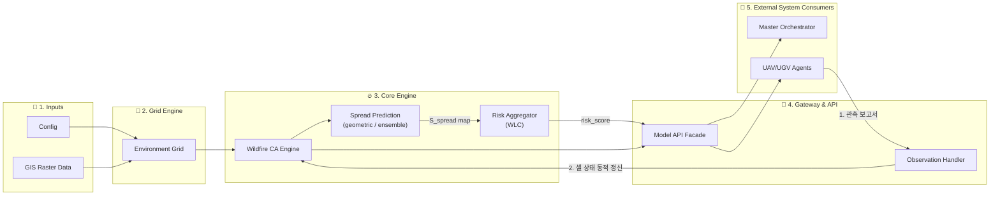
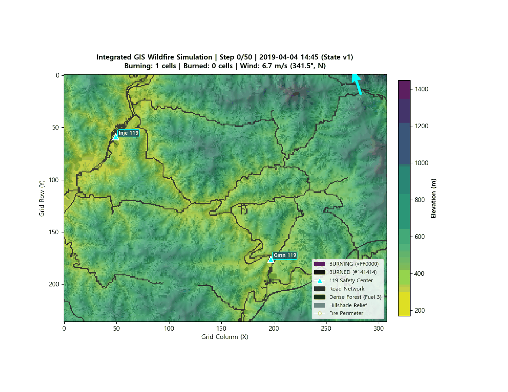

# 🌲 Wildfire Multi-Agent Environmental Modeling Subsystem
> **산불 다중 에이전트 대응 시뮬레이션 — 환경 및 산불 모델 (Environment & Wildfire Model)**

본 모듈은 **Multi-Agent Wildfire Response Simulation Environment** 프로젝트의 하위 시스템으로, 실제 지형 GIS(GeoTIFF)  raster 데이터를 불러오고, 지형·식생·기상 정보를 반영한 2D 격자(Grid)를 생성, Rothermel 표면 확산 모델 바탕의 **Cellular Automata(CA) 산불 확산 시뮬레이션**, **실시간 화재 위험도(Risk Score) 산출**, 그리고 드론(UAV)·지상로봇(UGV)의 **현장 관측 정보 동적 반영 기능**을 제공한다.

---

## 📌 목차 (Table of Contents)
1. [💡 프로젝트 개요 (Overview)](#-프로젝트-개요-overview)
2. [🔄 환경 모델 전체 흐름도 (Workflow & Architecture)](#-환경-모델-전체-흐름도)
3. [🔥 Cellular Automata (CA) 산불 확산 수식 및 원리](#-cellular-automata-ca-산불-확산-수식-및-원리)
4. [⚠️ Dynamic Risk Scoring (복합 위험도 산출 공식)](#️-dynamic-risk-scoring-복합-위험도-산출-공식)
5. [🔌 Public API & 시스템 통합 규격 (Facade API)](#-public-api--시스템-통합-규격-facade-api)
6. [📁 디렉터리 구조 (Directory Structure)](#-디렉터리-구조-directory-structure)
7. [🛠️ 개발 환경 및 주요 라이브러리 (Tech Stack)](#️-개발-환경-및-주요-라이브러리-tech-stack)
8. [🚀 Integrated GIS Visualization 실행 방법](#-integrated-gis-visualization-실행-방법)

---

## 💡 프로젝트 개요 (Overview)

### 산불 환경 모델링의 목적과 역할
본 환경 모델의 주 목적은 특정 지역의 산불을 가상 예측하고, **총괄 오케스트레이터(Master Orchestrator)의 자원 배치 및 재할당 판단**과 **UAV/UGV 에이전트의 접근성 판별**을 가능하게 만드는 **동적 환경 상태(State Space)를 제공**하는 것이다.

* **지형 및 도로망 반영**: 능선 및 경사도로 인한 UGV 지상 자원의 우회 경로 판별 및 도로망 차단 여부 평가
* **기상 변수 결합**: 풍향 및 풍속 변화에 따른 실시간 화재 확산 방향 및 위험지역(Downwind Risk Area) 동적 계산
* **이종 자원 접근성 차이**: UAV(공중)와 UGV(지상)가 체감하는 접근 제한 요소(경사, 고도, 도로 유무) 분리 제공
* **현장 관측 갱신 (Closed-Loop Update)**: UAV/UGV가 전달한 정밀 관측 정보(`ObservationReport`)를 수용하여 환경 격자의 상태와 위험도를 실시간으로 재계산

---

## 🔄 환경 모델 전체 흐름도

아래 파이프라인은 공간 raster 데이터 입력부터 2D 셀 격자 ingestion, 산불 확산 계산, 위험도 산출, 현장 관측 갱신, 그리고 외부 API 연동까지의 데이터 흐름을 나타낸다.



---

## 🔥 Cellular Automata (CA) 산불 확산 수식 및 원리

셀룰러 오토마톤(Cellular Automaton)은 격자 형태의 공간에서 각 세포(Cell)가 주변 세포들의 상태에 따라 정해진 규칙에 맞춰 동시에 자신의 상태를 변화시켜 나가는 계산 모델이다. 산불 확산 엔진(`WildfireCAEngine`)은 discrete time-step Cellular Automata 방식을 사용하며, 각 셀은 `UNBURNED`, `BURNING`, `BURNED` 3가지 상태를 거친다.

### 1. 셀 상태 전이 (State Lifecycle)

```text
                           확률적 발화                         연소 완료   
          [UNBURNED] ---------------------> [BURNING] ---------------------> [BURNED]
                      확산 확률 P_combined               지정 지속 시간 T_burn
```

* **BURNING**: 연소 중인 상태로 주변 `UNBURNED` 셀로 불꽃을 확산시킴.
* **BURNED**: 설정 파일(`burn_duration_steps`, 현재 기본값: 5 step)에 지정된 기간이 지나면 숯/재 상태로 전이되어 더 이상 연소하지도 확산시키지도 않음.

### 2. 이웃 셀 확산 확률 수식 (Pairwise Spread Probability)
연소 중인 셀 $S$(Source)로부터 미연소 이웃 셀 $T$(Target)로 산불이 번질 확률 $P(S \to T)$는 Rothermel 표면 확산 모델의 물리적 인자를 정규화하여 산출한다:

$$P(S \to T) = P_{\text{base}} \cdot f_{\text{fuel}}(T) \cdot f_{\text{moisture}}(T) \cdot f_{\text{slope}}(S, T) \cdot f_{\text{wind}}(S, T)$$

참고) 연산 결과 P(S → T)는 max(0.0, min(1.0, P))를 통해 [0.0, 1.0] 범위 내로 보정(Clamping)됨

* **기본 확산 확률 ($P_{\text{base}}$)**: `fire_ca.base_spread_probability` (기본값: $0.40$)
* **연료 가중치 ($f_{\text{fuel}}$)**: Target 셀의 물리적 연료량 (`fuel_amount` $\in [0.0, 1.0]$). 연료가 $0.0$인 미연소/도로/수역 셀은 확산 확률이 $0$이 된다.
* **습도 감쇄 인자 ($f_{\text{moisture}}$)**:

$$f_{\text{moisture}}(T) = \max\left(0.0, 1.0 - w_{\text{moisture}} \cdot \text{moisture}_T\right)$$

* **경사 보정 인자 ($f_{\text{slope}}$)**: 고도 차이 $\Delta z = z_T - z_S$와 평면/공간 거리를 이용한 Gradient 지수 보정 (오르막 $\Delta z > 0$ 확산 촉진, 내리막 $\Delta z < 0$ 확산 억제):
  
$$f_{\text{slope}}(S, T) = \exp\left(w_{\text{slope}} \cdot \frac{z_T - z_S}{d(S, T)}\right)$$

* **바람 지향성 보정 인자 ($f_{\text{wind}}$)**: 풍속 $v_{\text{wind}}$와 확산 방향 벡터 $\hat{u}_ {S \to T}$, 바람이 불어가는 방향 벡터 $\hat{w}_{\text{towards}}$ 간의 내적(Dot Product) 일치도 alignment 보정:

$$f_{\text{wind}}(S, T) = 
\exp\left(
w_{\text{wind}}
\cdot
v_{\text{wind}}
\cdot
\left(
\hat{u}_{S \to T}
\cdot
\hat{w}_{\text{towards}}
\right)
\right)
$$

### 3. 다중 이웃 연소 셀에 의한 결합 확산 확률 (Combined Ignition Probability)
Target 셀 $T$가 주변의 여러 연소 셀 $\{S_1, S_2, \dots, S_k\}$로부터 동시에 열을 받는 경우, 어느 한 셀로부터도 발화되지 않을 확률의 여집합으로 결합 발화 확률을 계산한다 (적어도 하나가 성공할 확률):

$$P_{\text{combined}}(T) = 1.0 - \prod_{i=1}^{k} \left(1.0 - P(S_i \to T)\right)$$

RNG(Random Number Generator) 난수 시드(`seed`)로 `roll < P_combined` 조건을 평가하여 발화를 결정한다.

---

## ⚠️ Dynamic Risk Scoring (복합 위험도 산출 공식)

`src/risk.py` 모듈은 오케스트레이터의 자원 배치 우선순위 결정을 위해 각 셀별 복합 위험도(`risk_score` $\in [0.0, 1.0]$)를 산출한다.

$$\text{risk}_{\text{score}}(T) = \begin{cases} 
\text{clamp}_{[0, 1]}\left(B + (1.0 - B) \cdot E\right) & \text{if } \text{fire}_{\text{state}} = \text{BURNING} \\
0.2 & \text{if } \text{fire}_{\text{state}} = \text{BURNED} \\
\text{clamp}_{[0, 1]}\left(\sum_{i} W_i \cdot S_i\right) & \text{if } \text{fire}_{\text{state}} = \text{UNBURNED}
\end{cases}$$

*(단, $B$는 `burning_risk_floor` 기본값 $0.70$, $E$는 노출 가중치 재정규화 점수 $E = \frac{\sum_{\text{exp}} W_i S_i}{\sum_{\text{exp}} W_i}$)*


### 1. UNBURNED 셀 복합 위험도 (Two-Level WLC)

미연소 셀의 위험도는 화재 확산 위험도($S_{\text{spread}}$)와 정적 건물/인프라 노출 성분($S_{\text{human}}, S_{\text{infra}}, S_{\text{property}}, S_{\text{secondary}}$)을 다기준 가중 선형 결합(Weighted Linear Combination, WLC)하여 산출한다:

$$\text{risk}_{\text{score}} = W_{\text{spread}} \cdot S_{\text{spread}} + W_{\text{human}} \cdot S_{\text{human}} + W_{\text{infra}} \cdot S_{\text{infra}} + W_{\text{property}} \cdot S_{\text{property}} + W_{\text{secondary}} \cdot S_{\text{secondary}}$$

$$\left(\sum W_i = 1.0, \quad \text{설정 파일의 가중치를 런타임에 자동 정규화}\right)$$

| 성분 ($S_i$) | 명칭 | 평가 기준 및 proxy 소스 |
| :--- | :--- | :--- |
| $S_{\text{spread}}$ | 화재 확산 위험도 | `fire_model.py` 확산 모드(`geometric` 또는 `ensemble`) 결과값 $\in [0.0, 1.0]$ |
| $S_{\text{human}}$ | 인명 피해 노출 | 주거용 건물 proxy (`building_type = 1`, RESIDENTIAL) |
| $S_{\text{infra}}$ | 주요 인프라 노출 | 중요/핵심 공공 시설 proxy (`building_type = 2, 3`, IMPORTANT/CRITICAL) |
| $S_{\text{property}}$ | 재산 피해 노출 | 상업/공업 시설 proxy (`building_type = 5, 6`, COMMERCIAL/INDUSTRIAL) |
| $S_{\text{secondary}}$ | 2차 재해 위험 | 위험물/유해 시설 proxy (`building_type = 4`, SECONDARY_HAZARD) |


### 2. 복합 가중치 설정 (`config/environment_config.yaml`)

AHP (Analytic Hierarchy Process)를 통하여 설정 파일의 아래 가중치를 산출하였다.
```yaml
composite_weights:
  spread: 0.0384                  # W_spread: 화재 확산 위험도 가중치 (S_spread)
  human: 0.6337                   # W_human: 주거/인명 노출 가중치 (S_human)
  infrastructure: 0.1815          # W_infra: 중요/핵심 시설 가중치 (S_infra)
  property: 0.0869                # W_property: 상업/공업 재산 가중치 (S_property)
  secondary_hazard: 0.0595        # W_secondary: 위험물 2차 피해 가중치 (S_secondary)
```

> **💡 위험도 모델링 설계 원칙 (Modeling Rationale)**:
> 1. **위해성(Hazard)과 노출(Exposure)의 분리**: 물리적 환경 조건에 따른 화재 확산 가능성($S_{\text{spread}}$)과 지상의 자산/인명 노출은 성격이 다른 독립 차원으로 분리 모델링된다.
> 2. **운영 우선순위와 수치 위험도의 분리**: 인명 최우선 원칙(SOP)은 오케스트레이터의 태스크 스케줄링 및 자원 할당 정책 계층에서 반영되며, 환경 모델의 `risk_score`는 객관적 공간 복합 위험도를 제공한다.

---

<details>
<summary><b>[화재 확산 위험도 (S_spread)]</b></summary>
<br>

### Spread Prediction (확산 위험도 예측 모델)

`WildfireCAEngine` (`src/fire_model.py`)은 화재 확산 위험도 $S_{\text{spread}} \in [0.0, 1.0]$을 산출하는 두 가지 모드를 제공하며, 계산된 $S_{\text{spread}}$ 맵은 위험도 집계 모듈(`risk.py`)에 전달된다.

---

#### 아키텍처: 확산 물리와 위험도 집계의 책임 분리

```text
┌─────────────────────────────────────────────────────────────┐
│ fire_model.py (WildfireCAEngine)                            │
│  [1] Geometric Baseline (공간 휴리스틱: 경사 + 연료 + 풍하측)   │
│  [2] Ensemble CA (N-step M-run 몬테카를로 발화 확률 추정)       │
└──────────────────────────────┬──────────────────────────────┘
                               │ S_spread map (Dict[cell_id, float])
                               ▼
┌─────────────────────────────────────────────────────────────┐
│ risk.py (Pure Multi-Criteria WLC Aggregator)                │
│  - 확산 물리 계산을 수행하지 않음 (순수 집계 모듈)                │
│  - WLC 가중합: S_spread + 건물 노출 성분 (S_human, S_infra…)   │
└──────────────────────────────┬──────────────────────────────┘
                               │ risk_score map (Dict[cell_id, float])
                               ▼
                        Public API / Grid
```

* **책임 분리**: `risk.py`는 풍향 벡터, 지형 경사도, 식생 물리 계산을 직접 수행하지 않으며, 외부에서 주입된 $S_{\text{spread}}$를 건물 노출 성분과 가중합하는 순수 집계(Pure WLC Aggregator) 역할만 담당한다.

---

#### 모드 1: Geometric Baseline (공간 heuristic 모드)

풍향 원뿔(Downwind Cone), 정규화 경사도, 식생 연료량의 1차 가중합으로 계산하는 결정론적 베이스라인 모드이다:

$$S_{\text{spread}}(T) = w_{\text{slope}} \cdot S_{\text{slope}} + w_{\text{fuel}} \cdot S_{\text{fuel}} + w_{\text{downwind}} \cdot S_{\text{downwind}}$$

$$\left(w_{\text{slope}} + w_{\text{fuel}} + w_{\text{downwind}} = 1.0\right)$$

* **경사 성분 ($S_{\text{slope}}$)**: $\min\left(1.0, \frac{\text{slope}}{\text{max}_{\text{slope}}}\right)$ (기본 최대 기준: $45^\circ$)
* **연료 성분 ($S_{\text{fuel}}$)**: 셀의 `fuel_amount` $\in [0.0, 1.0]$
* **풍하측 성분 ($S_{\text{downwind}}$)**: 현재 `BURNING` 셀로부터 `downwind_buffer_cells` 반경 이내이고 풍향 벡터 정렬 임계치(`downwind_dot_threshold` $> 0.3$)를 만족할 경우 $1.0$, 그 외 $0.0$
* $w_i$ 는 설정 파일에서 설정

---

#### 모드 2: N-step CA Ensemble (몬테카를로 전방 시뮬레이션 모드)

현재 화재 상태로부터 $N$ 스텝 전방 CA 확산 시뮬레이션을 $M$회 독립 실행하여, 각 미연소 셀이 향후 $N$ 스텝 이내에 발화할 경험적 도달 확률(Empirical Arrival Probability)을 추정한다:

$$S_{\text{spread}}(\text{cell}) = P(\text{cell이 } N\text{ 스텝 이내 BURNING 상태로 전이}) = \frac{\sum_{m=1}^{M} \mathbb{I}(\text{run } m\text{에서 발화})}{M}$$

> **핵심 동작 보장**:
> 1. **비파괴적 실행 (Non-mutating Guarantee)**:
>       * 메인 시뮬레이션 격자(`EnvironmentGrid`), 셀 상태(`fire_state`), 연소 카운터(`_burn_counters`), 메인 난수 생성기(`_rng`)를 전혀 변경하지 않고 격리된 상태 복사본에서 실행된다.
> 2. **시드 기반 결정론적 재현성 (Bitwise Reproducibility)**:
>       * 각 앙상블 실행은 `run_seed = (base_seed * 10007 + run_idx + 1) & 0xFFFFFFFF` 공식에 의해 독립적이면서도 동일 시드에서 100% 동일한 결과를 보장한다.
> 3. **프로토타입 설정 ($N=10, M=10$) 및 공학적 타협 (Engineering Trade-off)**:
>       * **선정 배경**: 경험적 벤치마크 결과, $M=5$ 대비 $M=10$에서 평균 절대 오차(MAD)가 약 53% 감소하여 몬테카를로 안정성이 크게 향상되었으며, $N=10$은 약 1km 반경의 전방 위험 권역을 안정적으로 포착함과 동시에 $\approx 160\text{ ms}$ 수준의 낮은 연산 지연을 유지한다.
>       * **한계점 (Limitations)**: 통계학적 관점에서 $M=10$은 확률 해상도가 10% 단위($0.0, 0.1, \dots, 1.0$)로 제한되며, 희박한 사건(Rare Event) 추정에 오차가 존재한다 (엄밀한 통계적 신뢰성은 $M \ge 100$ 권장). 따라서 현재 $M=10$은 실시간 통합 루프를 위한 실용적 초기 타협점(Compromise)이다.
>       * **향후 고도화 방안 (Future Scaling)**
>           - **비동기 백그라운드 예측 (Async Prediction)**: 메인 동기 루프와 분리된 비동기 워커에서 대규모 앙상블($M \ge 100$) 주기적 실행
>           - **연산 가속 (JIT / GPU)**: Numba JIT 컴파일 또는 C 확장을 통한 10~50배 연산 속도 개선
>           - **적응형 앙상블 (Adaptive $M$)**: 화재 전면부 및 인명/주요 자산 밀집 영역에 국소적 고표본 앙상블 집중 할당

---

#### 확산 예측 모드 설정 (`config/environment_config.yaml`)

```yaml
risk_scoring:
  # 확산 예측 모드 선택 ("geometric" 또는 "ensemble")
  spread_mode: "geometric"

  # N-step CA 앙상블 설정 (spread_mode: "ensemble" 시 적용)
  ensemble:
    steps: 10                    # 전방 예측 지평 (Forecast Horizon N)
    runs: 10                     # 몬테카를로 궤적 수 (Ensemble Size M)

  # Geometric 모드 가중치 (spread_mode: "geometric" 시 적용)
  spread_component_weights:
    slope: 0.3333333333
    fuel: 0.3333333333
    downwind: 0.3333333333
```

<br>
</details>

---

<details>
<summary><b>[화재 확산 위험도 (S_spread) - Ensemble CA benchmark 실행 방법]</b></summary>
<br>

`src/benchmark.py` 모듈은 N-step CA 앙상블 모드의 예측 지평($N$) 및 몬테카를로 실행 횟수($M$) 파라미터 조합에 따른 연산 지연 시간(ms), 공간 위험 커버리지(%) 및 수렴 오차(MAD)를 터미널에서 직접 평가할 수 있는 CLI 도구를 제공한다.

### 기본 실행 명령

```bash
# 기본 파라미터 그리드 (N=[3, 5, 10, 15], M=[5, 10, 20]) 실행
python -m src.benchmark
```

### CLI 주요 매개변수 옵션 (CLI Arguments)

| 옵션 플래그 | 타입 | 기본값 | 설명 |
| :--- | :--- | :--- | :--- |
| `-n`, `--n-values` | `int ...` | `3 5 10 15` | 평가할 전방 예측 지평 스텝 수 N 목록 (예: `-n 10` 또는 `-n 5 10 15`) |
| `-m`, `--m-values` | `int ...` | `5 10 20` | 평가할 몬테카를로 앙상블 횟수 M 목록 (예: `-m 10` 또는 `-m 10 20`) |
| `--x` | `int` | `120` | 초기 발화 셀 X 열(Column) 인덱스 |
| `--y` | `int` | `120` | 초기 발화 셀 Y 행(Row) 인덱스 |
| `--repetitions` | `int` | `3` | 각 (N, M) 조합당 연산 시간 측정 반복 횟수 |
| `--ref-runs` | `int` | `50` | MAD 수렴 오차 계산을 위한 참조 고표본 앙상블 크기 |
| `--seed` | `int` | `42` | 시뮬레이션 난수 시드 |

### CLI 실행 예시

#### 1. 특정 커스텀 (N, M) 값 벤치마크 (예: N=10, M=10)
```bash
python -m src.benchmark -n 10 -m 10
```

#### 2. 사용자 지정 파라미터 그리드 평가 (예: N=[5, 10, 15], M=[10, 20])
```bash
python -m src.benchmark -n 5 10 15 -m 10 20 --repetitions 5
```

### 최적 $N$과 $M$ 선택 방법

출력된 벤치마크 결과 표의 지표를 활용하여 $N$(예측 지평)과 $M$(몬테카를로 앙상블 크기)을 결정할 수 있다:

#### 1. $N$ (전방 예측 지평, Forecast Horizon) 선택 기준
* **주요 지표**: `Non-zero Cells` (영향을 받는 셀 수) & `Grid Cover %` (공간 커버리지 비율)
* **선택 방법**:
  * $N=3$: 발화점 주변 극소수 셀(10~15개, 약 200~300m 반경)만 포착하여 오케스트레이터의 사전 자원 배치(Pre-positioning) 범위 부족.
  * $N=10$: 약 80~100개 셀(약 1km 반경)의 위험 영향 권역을 포착하여 실질적인 전방 대비 지평을 제공.
  * **기준**: 오케스트레이터의 자원 전진 배치에 필요한 **목표 전방 영향 범위(예: 1km 내외)를 포착하는 최소 $N$**을 선택 (현재 프로토타입: $N=10$).

#### 2. $M$ (몬테카를로 앙상블 크기) 선택 기준
* **주요 지표**: `MAD vs Ref (Affected)` (고표본 $M=50$ 대비 수렴 오차) & `Avg Time (ms)` (연산 지연 시간)
* **선택 방법**:
  * **수렴 오차(MAD)와 연산 지연 시간의 엘보우 포인트(Elbow Point)** 찾기.
  * $M=5 \to M=10$: 수렴 오차(MAD)가 약 53% 급감하며 몬테카를로 수렴 안정성이 크게 향상됨.
  * $M=10 \to M=20$: 오차는 소폭 추가 감소하지만, 연산 지연 시간이 2배로 증가하여 한계 효용이 감소함.
  * **기준**: 오차 감소 곡선의 elbow 지점이면서 실시간 통합 루프 지연 예산(예: $< 200\text{ ms}$)을 충족하는 $M$을 선택 (현재 프로토타입: $M=10$).

#### 3. 선택된 $N, M$을 설정 파일에 반영하는 방법
결정된 파라미터를 `config/environment_config.yaml`에 적용:
```yaml
risk_scoring:
  spread_mode: "ensemble"
  ensemble:
    steps: 10                   # 선택한 N
    runs: 10                    # 선택한 M
```

<br>
</details>

---

<details>
<summary><b>[건물/인프라 노출 위험도 (S_human, S_infra, S_property, S_secondary)]</b></summary>
<br>

`buildings_inje.tif` 에 있는 building type정보로 $S_i$ 에 기본값을 부여한다.

### 건물 유형(Building Type) → 노출 성분 매핑 규칙

| `building_type` 코드 | 건물 유형 | 기여 노출 성분 ($S_i$) | 기본 부여값 |
| :---: | :--- | :--- | :---: |
| `0` | 없음 (일반 산림/토지) | — | $0.0$ |
| `1` | RESIDENTIAL (주거) | $S_{\text{human}}$ | $1.0$ |
| `2` | IMPORTANT (중요 시설) | $S_{\text{infra}}$ | $0.7$ |
| `3` | CRITICAL (핵심 시설) | $S_{\text{infra}}$ | $1.0$ |
| `4` | SECONDARY_HAZARD (위험물) | $S_{\text{secondary}}$ | $1.0$ |
| `5` | COMMERCIAL (상업) | $S_{\text{property}}$ | $1.0$ |
| `6` | INDUSTRIAL (산업) | $S_{\text{property}}$ | $1.0$ |
| `7` | OTHER (기타) | — | $0.0$ |

<br>
</details>

---

<details>
<summary><b>[AHP Multi-Criteria Weighting: 최상위 복합 위험도 가중치 (W_i) 산출 절차 및 CLI 실행 가이드]</b></summary>

---

### 1. AHP (Analytic Hierarchy Process) 도입 목적
위험도 모델의 5개 최상위 평가 기준(`spread`, `human`, `infrastructure`, `property`, `secondary_hazard`)에 대한 가중치($W_i$)를 주관적 임의 할당이 아닌, 다기준 의사결정 기법(AHP 쌍대비교 및 주 고유벡터법)을 통해 객관적으로 도출하고 논리적 일관성을 검증한다.

> **단순화 설계 원칙**: 팀원별 개별 설문 취합 및 기하평균(Geometric Mean) 집계는 코드 외부에서 사전 수행되며, AHP 계산 모듈(`src/ahp.py`)은 **이미 집계된 최종 $5 \times 5$ 그룹 쌍대비교 행렬**만을 입력받아 처리한다.

---

### 2. 평가 기준 및 행렬 정의 (Criteria & Matrix Definition)
행렬의 행·열 및 반환 가중치는 아래의 고정된 기준 순서를 따른다:

```python
CRITERIA = ["spread", "human", "infrastructure", "property", "secondary_hazard"]
```

5×5 쌍대비교 행렬 $A = [a_{ij}]$는 다음 조건을 만족해야 한다:
1. **양수 조건**: $a_{ij} > 0$
2. **대각 성분 조건**: $a_{ii} = 1.0$
3. **역수 대칭성 (Reciprocal Property)**: $a_{ij} \cdot a_{ji} \approx 1.0 \quad \left(a_{ji} = \frac{1}{a_{ij}}\right)$

---

### 3. 수학적 산출 공식 및 일관성 검증 절차

```text
       5x5 Group Matrix (A)
                │
                ▼
  Principal Eigenvector Method: A @ w = λ_max * w
                │
                ▼
     Normalized Weights (Σ w_i = 1.0)
                │
                ▼
  Consistency Index: CI = (λ_max - n) / (n - 1)
                │
                ▼
  Consistency Ratio: CR = CI / RI  (RI = 1.12 for n=5)
                │
                ▼
  Consistency Check: CR < 0.10  (Consistent: True / False)
```

#### ① 주 고유벡터법 (Principal Eigenvector Method)
NumPy 고유값 분해(`np.linalg.eig`)를 통해 행렬 $A$의 특성 방정식 $A \mathbf{w} = \lambda_{\max} \mathbf{w}$를 푼다:

* 최대 실수부 고유값 탐색:
  $$\lambda_{\max} = \max\left(\text{Re}(\lambda_k)\right)$$
* 해당 주 고유벡터 $\mathbf{w}$ 추출 및 양수화:
  $$\text{if } \sum w_k < 0 \implies \mathbf{w} \leftarrow -\mathbf{w}$$

#### ② 가중치 정규화 (Weight Normalization)
고유벡터 성분의 합이 $1.0$이 되도록 정규화하여 최종 가중치 벡터 $\mathbf{W}$를 산출한다:

$$W_i = \frac{w_i}{\sum_{k=1}^{n} w_k} \quad \left(\sum_{i=1}^{n} W_i = 1.0, \quad W_i > 0\right)$$

#### ③ 일관성 지수 (Consistency Index, CI)
완전 일관된 행렬의 경우 $\lambda_{\max} = n$이며, 일관성이 떨어질수록 $\lambda_{\max} > n$이 된다 ($n=5$):

$$CI = \frac{\lambda_{\max} - n}{n - 1} = \frac{\lambda_{\max} - 5}{4}$$

#### ④ 일관성 비율 (Consistency Ratio, CR)
무작위 생성된 정방 역수 행렬의 평균 일관성 지수인 Saaty Random Index ($RI$, $n=5$일 때 $RI = 1.12$) 대비 비율을 산출한다:

$$CR = \frac{CI}{RI} = \frac{CI}{1.12}$$

* **Saaty의 표준 RI 기준표**:
  | 행렬 크기 ($n$) | 1 | 2 | 3 | 4 | **5** | 6 | 7 | 8 | 9 | 10 |
  | :---: | :---: | :---: | :---: | :---: | :---: | :---: | :---: | :---: | :---: | :---: |
  | **$RI$** | 0.00 | 0.00 | 0.58 | 0.90 | **1.12** | 1.24 | 1.32 | 1.41 | 1.45 | 1.49 |

#### ⑤ 일관성 판별 (Consistency Decision)
* **$CR < 0.10$**: 쌍대비교 판단의 논리적 일관성이 충분히 확보됨 $\rightarrow$ **가중치 채택 가능**
* **$CR \ge 0.10$**: 비교 판단에 논리적 모순/불일치 존재 $\rightarrow$ **쌍대비교 재조정 필요**

---

### 4. 터미널 CLI 실행 방법 (How to Run `ahp.py`)

AHP 모듈(`src/ahp.py`)은 터미널에서 독립 실행 가능하다.

#### ① 기본 실행 (예제 5×5 행렬 결과 및 보고서 확인)
```bash
python -m src.ahp
```

#### ② JSON 행렬 직접 전달 (`--matrix`)
```bash
python -m src.ahp --matrix "[[1, 0.111, 0.2, 0.333, 0.5], [9, 1, 7, 8, 7], [5, 0.143, 1, 3, 4], [3, 0.125, 0.333, 1, 2], [2, 0.143, 0.25, 0.5, 1]]"
```

#### ③ 파일 입력 (`--file`, `.json`, `.csv`, `.txt` 지원)
```bash
python -m src.ahp --file path/to/matrix.csv
```

#### ④ YAML 설정 스니펫만 출력 (`--yaml-only`)
`config/environment_config.yaml`의 `composite_weights`에 복사할 YAML 스니펫만 즉시 출력합니다:
```bash
python -m src.ahp --file matrix.csv --yaml-only
```

*출력 예시:* `python -m src.ahp`
```yaml
risk_scoring:
  composite_weights:
    spread: 0.0463
    human: 0.5731
    infrastructure: 0.2282
    property: 0.0906
    secondary_hazard: 0.0618
```

#### ⑤ 파이썬 코드 내 직접 호출 예시
```python
import numpy as np
from src.ahp import calculate_ahp_weights, format_ahp_report

matrix = np.array([
    [1.0,   1.0/9.0, 1.0/5.0, 1.0/3.0, 1.0/2.0],
    [9.0,   1.0,     7.0,     8.0,     7.0    ],
    [5.0,   1.0/7.0, 1.0,     3.0,     4.0    ],
    [3.0,   1.0/8.0, 1.0/3.0, 1.0,     2.0    ],
    [2.0,   1.0/7.0, 1.0/4.0, 1.0/2.0, 1.0    ],
], dtype=float)

result = calculate_ahp_weights(matrix)
print(format_ahp_report(result))
```

> **비침습성 보장**: `ahp.py`는 `environment_config.yaml`을 임의로 덮어쓰지 않으며, 도출된 결과는 검토 후 설정 파일에 반영한다.

</details>

---

## 🔌 Public API & 시스템 통합 규격 (Facade API)

`EnvironmentModelAPI` (`src/api.py`) 클래스는 다른 서브시스템(오케스트레이터, UAV, UGV, 통합 파트)이 환경 모델을 제어하고 조회할 수 있는 창구 역할을 제공한다.

| API 메서드 | 설명 | 반환/영향 타입 |
| :--- | :--- | :--- |
| `get_fire_locations()` | 현재 활성 연소 중인 `BURNING` 셀의 위치 및 식별자 반환 | `List[Dict[str, Any]]` |
| `get_fire_perimeter()` | 미연소 지형과 접해 있는 화재 외곽 경계 셀 리스트 산출 | `List[Dict[str, Any]]` |
| `get_risk_map()` | 전체 격자의 `cell_id` $\to$ `risk_score` 매핑 딕셔너리 반환 | `Dict[int, float]` |
| `get_spread_direction()` | 현재 바람 설정 기반의 예측 확산 방향 및 방위각 반환 | `Dict[str, Any]` |
| `get_environment_state()` | 상태 버전(`state_version`), 시간인출, 셀 카운트 등 메타데이터 반환 | `Dict[str, Any]` |
| `apply_observation(report)` | UAV/UGV의 현장 관측 보고서 반영 및 위험도 자동 재계산 | `Dict[str, Any]` |
| `step()` | CA 시뮬레이션 1 단계(Step) 진행 및 새로 발화된 셀 리스트 반환 | `List[Cell]` |

---

## 📁 디렉터리 구조 (Directory Structure)

본 프로젝트의 환경 모델 관련 핵심 소스 코드, 설정 파일, 데이터 및 테스트 디렉터리 구조이다.

```text
environment/
├── config/
│   └── environment_config.yaml      # 공간, 식생 매핑, 바람, CA 확산, Risk 수식 통합 설정
├── data/
│   ├── raw/                         # 원본 unedited GIS 데이터 (DEM, 도로, 임상도 등 - Immutable)
│   └── processed/                   # 정제 및 좌표 동기화된 래스터/벡터 데이터
│       ├── dem_clipped.tif          # 고도 래스터 (DEM, EPSG:5186)
│       ├── slope_5186.tif           # 경사도 래스터
│       ├── aspect_5186.tif          # 향(Aspect) 래스터
│       ├── fuel_type.tif            # 토지피복/식생 피복 유형 래스터
│       ├── roads_raster.tif         # 도로망 래스터
│       ├── buildings_inje.tif       # 건물 유형 래스터 (RESIDENTIAL, IMPORTANT, CRITICAL 등)
│       └── hillshade.tif            # 음영기복 래스터 Overlay용
├── src/                             # 환경 및 산불 모델 핵심 소스 모듈
│   ├── __init__.py
│   ├── ahp.py                       # AHP 기반 최상위 위험도 가중치 산출 및 일관성 검증 도구
│   ├── api.py                       # Public API Gateway Facade (EnvironmentModelAPI)
│   ├── benchmark.py                 # 확산 모드 비교 및 N-step CA 앙상블 벤치마크 도구
│   ├── cell.py                      # Cell 데이터 클래스 & FireState Enum 정의
│   ├── evaluation.py                # 산불 시뮬레이션-참조 래스터 공간 일치도(IoU/Dice) 및 면적 평가 모듈
│   ├── fire_model.py                # CA 엔진 & 확산 예측 (geometric / ensemble)
│   ├── grid.py                      # Rasterio 기반 raster 데이터 읽기 및 2D 격자 생성
│   ├── observation.py               # UAV/UGV 관측 보고서(ObservationReport) 반영기
│   ├── risk.py                      # Dynamic Risk Scoring WLC 다기준 집계 모듈
│   └── weather.py                   # 시계열 ASOS 기상 데이터 공급 및 풍향/풍속 벡터 평균 모듈
├── evaluate_2019_inje.py            # 2019 인제 산불 재구성 정량 평가 및 CSV/GeoTIFF 출력 실행 도구
├── images/                          # 시각화 gif 파일 저장
├── visualize_fire.py                # 6-Layer 통합 GIS 시각화 및 애니메이션 실행 도구
└── README.md                        # 본 환경 모델 시스템 통합 안내서
```
* `data/inje2019/burned_area/inje_2019_burn_reference_binary.tif`: Sentinel-2 dNBR에서 추정한 2019 인제 산불 피해 reference footprint (ground truth아님)

---

## 🛠️ 개발 환경 및 주요 라이브러리 (Tech Stack)

* **언어 (Language)**: Python 3.10+ (권장: Python 3.12)
* **공간 데이터 및 래스터 처리 (GIS & Spatial Analytics)**:
  * `rasterio` (v1.3+): GeoTIFF 래스터 파일 읽기, 좌표계 변환, Spatial Affine Transform 관리
  * `geopandas` (v0.14+): Vector 공간 데이터 처리 및 좌표 재투영
  * `numpy` (v1.26+): 2D 격자 데이터 매트릭스 연산 및 난수 시드(`Generator`) 관리
* **시각화 및 애니메이션 (Visualization)**:
  * `matplotlib` (v3.8+): Multi-layer GIS Overlay, Colorbar, HUD UI 및 애니메이션 GIF 생성
* **설정 및 검증 (Config & Testing)**:
  * `pyyaml`: YAML 설정 파일 불러오기
  * `pytest` (v8.0+): 자동화 유닛 및 수면 검증 테스트

---

## 🚀 Integrated GIS Visualization 실행 방법

`visualize_fire.py` 스크립트는 래스터 지형, 음영 기복, 식생, 도로망, 119 안전센터 및 산불 확산 레이어를 한눈에 시각화하고 애니메이션 파일(.gif)로 저장할 수 있는 통합 도구이다.

### 기본 실행 명령
```bash
python visualize_fire.py --x 120 --y 120 --steps 30
```

### CLI 주요 매개변수 옵션 (CLI Arguments)

| 옵션 플래그 | 타입 | 기본값 | 설명 |
| :--- | :--- | :--- | :--- |
| `--config` | `str` | `config/environment_config.yaml` | 시스템 YAML 설정 파일 경로 지정 |
| `--seed` | `int` | `42` | 확산 난수 시드 (동일 시드 입력 시 100% 동일 확산 실행) |
| `--x` | `int` | *Grid 중앙* | 초기 산불 발화 셀의 열(Column) 인덱스 |
| `--y` | `int` | *Grid 중앙* | 초기 산불 발화 셀의 행(Row) 인덱스 |
| `--steps` | `int` | `30` | 시뮬레이션을 진행할 총 타임스텝 수 |
| `--interval` | `int` | `200` | 애니메이션 프레임 간격 (ms) |
| `--save` | `str` | `None` | 애니메이션 결과 저장 파일 경로 (예: `output.gif`) |
| `--fps` | `int` | `5` | 저장되는 애니메이션 GIF 프레임 속도 (FPS) |

### 실행 예시

#### 1. 특정 발화점 지정 및 30 Step 저장
```bash
python visualize_fire.py --x 120 --y 120 --steps 30 --save fire_spread.gif --fps 5
```

#### 2. 시드값을 변경하여 재현성 비교 테스트
```bash
python visualize_fire.py --seed 1004 --steps 40 --interval 100
```

### 실행 화면

(2019/04/04 인제 산불 조건들로 실행)
```bash
$ python visualize_fire.py --steps 50
```



---

참고) 2019년 인제 산불 검증 리포트 생성
```bash
cd environment
python evaluate_2019_inje.py --steps 50
```

---

<details> 
<summary><b>[📚 참고 문헌 (References)]</b></summary>
<br>

### Cellular Automata & Fire Spread Simulation:

1. Karafyllidis, I., & Thanailakis, A. (1997). *A model for predicting forest fire spreading using cellular automata*. Ecological Modelling, 99(1), 87–97. https://doi.org/10.1016/S0304-3800(96)01942-4

2. Alexandridis, A., Vakalis, D., Siettos, C. I., & Bafas, G. V. (2008). *A cellular automata model for forest fire spread prediction: The case of the wildfire that swept through Spetses Island in 1990*. Applied Mathematics and Computation, 204(1), 191–199. https://doi.org/10.1016/j.amc.2008.06.046

3. Clarke, K. C., Brass, J. A., & Riggan, P. J. (1994). *A cellular automaton model of wildfire propagation and extinction*. Photogrammetric Engineering & Remote Sensing, 60(11), 1355–1367.

4. Trucchia, A., Meschiari, M., & Fiorucci, P. (2020). *PROPAGATOR: An operational cellular-automata based wildfire simulator*. Environmental Modelling & Software, 131, 104764. https://doi.org/10.1016/j.envsoft.2020.104764

5. Trucchia, A., Izadpanah, Z., D'Andrea, M., & Fiorucci, P. (2022). *Influence of input data uncertainty on cellular automata-based wildfire spread simulation*. Fire, 5(6), 205. https://doi.org/10.3390/fire5060205

6. Bi, S., Zhang, H., & Yang, L. (2021). *Comparison of different models to simulate forest fire spread: A case study*. Forestry Studies, 74(1), 125–138. https://doi.org/10.2478/fsmu-2021-0010

### Risk Score (Wildfire Risk Assessment & Multi-Criteria Evaluation):

1. Scott, J. H., Thompson, M. P., & Calkin, D. E. (2013). *A wildfire risk assessment framework for land and resource management*. General Technical Report RMRS-GTR-315, U.S. Department of Agriculture, Forest Service, Rocky Mountain Research Station. https://doi.org/10.2737/RMRS-GTR-315

2. Miller, C., & Ager, A. A. (2013). *A review of recent advances in risk analysis for wildfire management*. International Journal of Wildland Fire, 22(1), 1–14. https://doi.org/10.1071/WF11114

3. Chuvieco, E., Aguado, I., Yebra, M., Nieto, H., Salas, J., Martín, M. P., Vilar, L., Martínez, J., Martín, S., Ibarra, P., de la Riva, J., Baeza, J., Rodríguez, F., Molina, J. R., Herrera, M. A., & Zamora, R. (2010). *Development of a framework for the assessment of wildfire risk using remote sensing and geographic information systems*. Remote Sensing of Environment, 114(1), 171–186. https://doi.org/10.1016/j.rse.2009.08.015

4. Finney, M. A. (2005). *The challenge of quantitative risk analysis for wildland fire*. Forest Ecology and Management, 211(1-2), 97–108. https://doi.org/10.1016/j.foreco.2005.02.010

5. Pourghasemi, H. R., & Gayen, A. (2020). *Forest fire susceptibility and risk mapping using social/infrastructural vulnerability and environmental variables*. Journal of Environmental Management, 262, 110344. https://doi.org/10.1016/j.jenvman.2020.110344

### AHP (Analytic Hierarchy Process):

1. Saaty, T. L. (1987). *The analytic hierarchy process—what it is and how it is used*. Mathematical Modelling, 9(3-5), 161–176. https://doi.org/10.1016/0270-0255(87)90473-8

2. Kayet, N., Chakraborty, K., Pathak, K., Sahoo, S., & Dutta, S. (2020). *Forest fire risk mapping using analytical hierarchy process (AHP) and earth observation datasets: A case study in the mountainous terrain of Northeast India*. Land Use Policy, 99, 105026. https://doi.org/10.1016/j.landusepol.2020.105026

3. Kumar, A., & Pant, S. (2022). Analytical hierarchy process for sustainable agriculture: An overview. *MethodsX*, 9, 101895. https://doi.org/10.1016/j.mex.2022.101895

4. Sahin, S. (2024). Utilizing AHP and conjoint analysis in educational research: Characteristics of a good mathematical problem. *Education and Information Technologies*, 29, 25375–25401. https://doi.org/10.1007/s10639-024-12830-9

### Data:

1. 고도(DEM): [국토교통부 V-월드 디지털트윈국토](https://www.vworld.kr) > `공간정보 다운로드` 클릭  > `수치표고모델(DEM)_90M` 검색
    * 대체: [국토지리정보원 국토정보플랫폼](https://map.ngii.go.kr/) > `자료실` > `지도자료` > `공개DEM` > 시도 '강원특별자치도' & 시군구 '인제군' & 제작년도 '2025' > 검색 
2. 산림지도: [산림청](https://map.forest.go.kr/forest/) > 산림공간정보 다운로드 > 무료신청 > 일반인 신청 > 대축적 임상도(1:5000) > 2025년 임상도 또는 2019년 임상도(2015 ~ 2019)
3. 도로망: [국가교통DB(KTDB)](https://ktdb.go.kr/www/index.do)
4. GIS건물통합정보: [국토교통부 V-월드 디지털트윈국토](https://www.vworld.kr) > `공간정보 다운로드` 클릭  > `GIS건물통합정보` 검색
5. 기상관측자료: [기상청 기상자료개방포털 - 종관기상관측(ASOS)](https://data.kma.go.kr/data/grnd/selectAsosRltmList.do?pgmNo=36) 또는 [방재기상관측(AWS)](https://data.kma.go.kr/data/grnd/selectAwsRltmList.do?pgmNo=56)
6. 산불통계: 
    * [산림청 국가산불정보시스템 산불통계](https://fd.forest.go.kr/ffas/pubConn/movePage/sub3.do)
    * [산림청 산림임업통계플랫폼](https://kfss.forest.go.kr/stat/ptl/newStat/newStatDtl.do?curMenu=3193)
    * [산림청 산불통계데이터](https://www.data.go.kr/data/15121380/fileData.do?utm_source=chatgpt.com): 2022-2025
    * [KOSIS 시도별 산불발생 현황](https://kosis.kr/statHtml/statHtml.do?sso=ok&returnurl=https%3A%2F%2Fkosis.kr%3A443%2FstatHtml%2FstatHtml.do%3FtblId%3DDT_13625_A011%26orgId%3D136%26)
    * [산불발생현황](https://www.forest.go.kr/kfsweb/kfi/kfs/frfr/selectFrfrStatsArea.do?mn=AR04_01_03)
7. 산불지역:
    * [Copernicus Browser](https://browser.dataspace.copernicus.eu/)
    * [NASA FIRMS(Fire Information for Resource Management System)](https://firms.modaps.eosdis.nasa.gov/)
    * [Copernicus Burnt Area 2019](https://documentation.dataspace.copernicus.eu/APIs/SentinelHub/Data/clms/bio-geophysical-parameters/vegetation/burnt-area/ba_global_300m_monthly_v3.html)

<br>
</details>

---

<details> 
<summary><b>[📘 용어]</b></summary>
<br>

* **래스터(Raster)**: 지표면이나 이미지를 픽셀(Pixel)이라는 사각형 격자(Grid) 형태로 나누어 각 칸에 색상이나 수치 값을 저장하고 표현하는 방식.
* **DEM (Digital Elevation Model / 수치표고모델)**: 건물이나 식생을 제외한 순수한 맨땅의 지표면 높낮이(고도) 데이터를 격자 형태로 디지털화한 것.
* **EPSG:5186 (European Petroleum Survey Group 5186 / 한국 중부좌표계)**: 대한민국 중부 지역(서울·경기·충청·강원서부)의 위치를 정밀하게 표현하기 위해 국가에서 사용하는 표준 지도 좌표계 고유 번호.
* **GIS (Geographic Information System / 지리정보시스템)**: 공간 정보(위치, 주소 등)를 수집·저장·분석하여 지도 형태로 시각화하고 관리하는 전체적인 컴퓨터 시스템.
* **QGIS (Quantum GIS / 큐지아이에스)**: 누구나 무료로 다운로드하여 사용할 수 있는 오픈소스 형태의 대표적인 지리정보시스템(GIS) 데스크톱 소프트웨어로, DEM 데이터를 불러오거나 EPSG:5186 좌표계를 설정하여 공간 데이터를 시각화하고 분석할 수 있는 프로그램.
* **.tif (GeoTIFF):** 좌표 정보가 포함된 **래스터(격자) 데이터 파일**. 위성·항공 이미지뿐 아니라 DEM, 경사도, 연료 유형처럼 각 셀에 값을 저장하는 GIS 데이터에 주로 사용.
* **.gpkg (GeoPackage):** 점·선·면 등의 **벡터 데이터와 속성 정보를 저장하는 SQLite 기반 공간 데이터베이스 파일**. 여러 레이어를 하나의 파일에 저장할 수 있으며 QGIS 등에서 널리 사용.

---