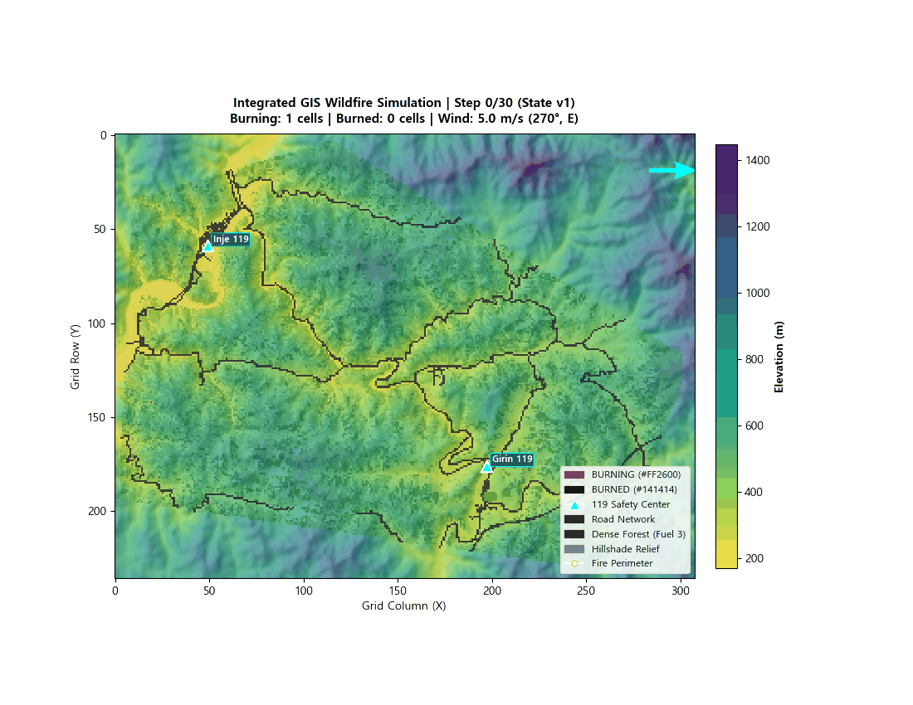

# 환경 모델링 파트 보고서

* **작성자**: 환경 모델 담당
* **참고자료**: [README.md](README.md)

<details>
<summary>[2026년 9월 21일 - DEM, 산림지도, 도로망 데이터 전처리 및 초기 산불 확산 모델 구축]</summary>
<br>

## 1. 담당 작업
- **전체 시스템에서의 역할**: 환경 / 산불 모델링
- **핵심 역할 및 구현 방식**:
  - **GIS 2D 환경 격자 구축 (`src/environment/grid.py`)**: 인제 원통-기린 지역 등 실제 GIS raster 데이터(`dem_clipped.tif`, `slope_5186.tif`, `aspect_5186.tif`, `fuel_type.tif`, `roads_raster.tif`)를 입력 처리하여 90m 셀 해상도의 2D `EnvironmentGrid` 생성.
  - **Cellular Automata 산불 확산 엔진 (`src/environment/fire_model.py`)**: Rothermel 표면 확산 모델의 영향을 반영한 확산 확률 기반 CA 엔진으로, 지형(경사), 기상(풍향/풍속), 식생(연료량), 습도를 반영하여 `UNBURNED -> BURNING -> BURNED` 상태 전이를 계산.
  - **위험도 산출 (`src/environment/risk.py`)**: 화재 상태, Downwind 유효 범위, 경사도 및 연료량 등을 조합해 셀 단위 `risk_score`를 계산.
  - **외부 연동 API 및 현장 관측 반영 (`src/environment/api.py`, `observation.py`)**: 총괄 Orchestrator, UAV/UGV 및 통합 시스템 연동용 `EnvironmentModelAPI` 제공 및 외부 관측 보고서(`ObservationReport`)를 입력받아 화재 상태/바람/습도 값을 모델에 반영할 수 있도록 구성.

---

## 2. 현재 진행 상황

- **완료 및 구현 중**: GIS 격자 구축, CA 산불 확산 엔진 초안, 위험도 산출, 환경 조회/API
  - **좌표계 / 격자 기준**:
    - 좌표계 (CRS): `EPSG:5186`
    - 격자 해상도: `90m / cell`
    - 격자 원점: `(298096.0, 591533.0)`
    - 격자 좌표계는 `+x = east`, `+y = south(row 증가 방향)` 기준 사용
- **진행 필요**: 입력 GIS raster 데이터 품질 재확인; Gazebo 3D·Web UI 연동용 좌표 변환 정리; 외부 시스템 연동을 위한 payload 스키마 및 출력 포맷 점검
- **임시 값**: (`config/environment_config.yaml`)
  1. 연료량 변환 기준 (`fuel_mapping`): 토지피복(`fuel_type` 0~3) → 물리적 연료량(0.0~1.0) 가중치는 현재 임시 가정값 사용.
  2. 위험도 산출 수식 (`risk_scoring`): `risk_score` 계산 기준(downwind buffer, slope weight 등)은 임시 시나리오 수식으로 구성; 총괄/통합 파트와 최종 표준 규격 협의 필요.
  3. 기초 기상 조건: 실시간 기상 API 미연동 상태로, 현재는 풍속 5m/s, 서풍(270°), 습도 0.2 등 시나리오 설정값 사용.
  -> 프로젝트를 위해 최적화된 값을 찾아야 할 듯.

---

## 3. 연결할 내용
- **다른 파트에서 받아야 할 정보 (Inputs)**:
  - **UAV / UGV**: 현장 수색/대응 시 관측한 정밀 화재 좌표, 화재 상태(`BURNING`/`UNBURNED`), 풍속/풍향, 관측 보고서 (`ObservationReport`).
  - **시스템 통합**: Web 관제 UI / Gazebo 3D 연동용 공통 좌표계 기준점 및 메시지 payload 표준 스키마 (JSON/Protobuf).
- **다른 파트에 제공할 결과 (Outputs)**:
  - **총괄 Orchestrator**: 활성 화재 위치 (`get_fire_locations`), 화재 외곽 경계 (`get_fire_perimeter`), 예측 확산 방향 벡터 (`get_spread_direction`), 셀별 위험도 맵 (`get_risk_map`).
  - **UGV**: 산불 확산 및 위험 지역 차단 경로 판별용 도로망 raster 레이어 및 위험도 맵.

---

## 4. 막힌 점 & 멘토 질의사항
- **현재 상태**:
  - 핵심 환경 모델 기능(GIS 격자, CA 확산, 위험도 산출)은 초기 구현 상태이며, 현재는 통합 점검과 입력 데이터 품질 점검 단계에 있음.

- **멘토 질의사항**:
  1. GIS 입력 데이터 품질 검증: 현재 GIS 입력 데이터 검증 범위가 시뮬레이션용으로 충분한지. 현재 DEM, slope, aspect, fuel, roads raster를 동일 shape/CRS/transform 기준으로 정렬 검증하여 격자화했는데, 산불 확산 시뮬레이션 입력 데이터로서 추가로 우선 점검해야 할 품질 항목(예: 해상도 적정성, nodata 처리, 연료 분류 신뢰도, 경사도 정확도 등)이 있는지.
  2. 현재 `risk_score`는 최종 표준 합의 전까지 시나리오 기반 임시 수식을 쓰고 있는데 시연 단계에서는 "설명 가능하고 입력 변화에 일관되게 반응하는지" 수준의 검증으로 충분한지, 아니면 추가적인 정량 사례 비교가 필요한지.

---

## 5. 다음 계획 및 도움
- **다음 계획**:
  - GIS 데이터 품질 점검; 모델 검증
  - 관측 반영 API 테스트 (화재 상태, 풍향/풍속, 셀 단위 습도)
  - 풍향/풍속 변화에 따른 위험도 및 확산 방향 변화 검증

- **도움이 필요한 부분**:
  - Web UI / Gazebo에서 사용할 공통 좌표계 기준점, 축 방향, 단위 체계; 환경 모델 API 결과를 수신할 payload 스키마(JSON/Protobuf) 협의
  - UAV/UGV 관측 보고 예시 데이터; 풍향/풍속/습도 관측값의 전달 주기 및 필수 필드 협의

---

## 실행 화면

```bash
$ python visualize_fire.py --x 19 --y 142 --steps 30 --save images/fire_spread.gif
```



<br>
</details>

---

<details>
<summary>[2026년 9월 28일 - 소방서 SOS반영하여 S_spread, S_human, S_infra, S_property, S_secondary 넣어 위험도 구성 변경]</summary>
<br>

완료 사항:
- 산불 spread 계산을 risk.py 에서 fire_model.py으로 옮김.
- N-step CA Monte Carlo ensemble를 넣어 전방 N=10을 보고 M=10를 돌려서 확률적으로 spread를 계산.
- AHP를 통해서 위험도의 w_spread, w_human, w_infra, w_property, w_secondary등의 가중치 계산.

다음 계획:
- 산림지도 `dem_clipped.tif`사이즈로 확장하기
- 도로망 `dem_clipped.tif`사이즈로 확장하기
- 위험도 개선

<br>
</details>

---

<details>
<summary>[2026년 10월 5일 - 2019/04/04 실제 인제 산불 조건으로 시뮬레이션 돌리고 burned area와 비교]</summary>
<br>

업무/문제점/개선 사항:

1. 2019년 4월 4일에 인제에서 났던 실제 산불이 났던 환경 조건들 데이터 전처리.
    - 온도, 풍향, 풍속, 습도, 최대 순간 풍속: 기상청 기상자료개방포털 - 종관기상관측(ASOS); 방재기상관측(AWS) > 일/시간/분 당 2019/04/04 ~ 2019/04/06 다운로드 (인제 관측소는 지상 202m정도에 있음; 기린 관측소는 292m)
      - 참고: 최대 순간 풍속(m/s)은 일별 데이터 (`Inje_ASOS_190404_day.csv`)에만 있음
    - 산림 데이터: [산림청](https://map.forest.go.kr/forest/) > 산림공간정보 다운로드 > 무료신청 > 일반인 신청 > 대축적 임상도(1:5000) > 2019년 임상도(2015 ~ 2019)
    - 도로망: [국가교통DB](https://ktdb.go.kr/) > 정보공개 > 자료신청 > 교통망 GIS DB > 세계좌표계 > 도로망(2019년 기준)
    - burned area를 Copernicus Browser에서 받기 > QGIS에서 작업 필요 > ground truth아님
      - Sentinel-2에서 받은 데이터로 만든 산불 지역이 실제 재해 지역을 완벽하게 재현한 것이 아님 -> 불확실한 지도에 CA를 맞추는 것이 될 수 있음.
    - `dem_clipped.tif`는 현재 것을 그대로 2019년에 적용
    - 2019년 인제 산불 당시 데이터는 `data/inje2019/` 에 저장
    - 2019년 인제 산불 모델링에서 기상은 분당 데이터 사용: data/inje2019/Inje_ASOS_190404_min.csv

2. 2019년 실제 인제 산불난 지역 vs. 산불 확산 모델 초기 비교했을 때 불이 점화되지 않았음
    - 초기 테스트에서 점화되지 않은 이유: ignition cell에 데이터가 없었음 (nodata).
    - 불이 안 퍼지는 이유: 그 지역에 no fuel cell이 많음
    - 풍향이 반대임: 점화되었을 때 기상청 ASOS 2019/04/04 14:45에 158.6 deg (남남동풍 - 남남동에서 오는 바람, 즉 북북서쪽)인데 지도에서 보면 불길이 퍼진 곳은 남남동쪽으로 보임. 기상청 ASOS에 있는 풍향(바람이 불어오는 방향) 데이터는 FROM이라고는 하지만 TOWARD일 수도 있으므로 설정파일에 두 모드를 넣고 테스트.
    * 풍향 문제 해결: 설정 파일에 wind_direction_convention: "from" 나 "toward" 선택할 수 있게 넣음 -> 결국 `FROM`선택
    * 점화 문제 개선: fuel barrier: nodata (-9999) -> 데이터 없으면 nearest 선택 (도로 있으면 block하는 것도 넣음)
    * nodata 처리 개선: 연료(fuel) 래스터에는 약 7,463개의 nodata(`-9999`) 셀이 발화 지점 주변에 흩어져 있었는데, 기존에는 이를 실제 비연료(class 0)와 동일하게 방화벽으로 처리하여 연료 연결성이 끊기면서 산불이 발화 직후 소멸하는 문제가 있었음. 이를 해결하기 위해 nodata 셀을 가장 가까운 유효 연료 등급으로 채우는 최근접 이웃(nearest-neighbor) 보간 방식을 도입하되, 실제 비연료(class 0: 수역/도로/나지)는 방화벽으로 그대로 유지함. 소양강의 물은 nodata처리에서 제외. 또한 설정상 발화점(lat/lon → row=100, col=13)이 nodata 셀에 놓여 불이 시작되지 못했기 때문에, 발화점이 비연료/nodata 셀일 경우 가장 가까운 연료 셀로 이동(snap)시키는 옵션을 추가함. 
    * Sensitivity analysis / Grid search: Sentinel-2 기반 2019년 인제 산불 피해 참조 데이터를 대상으로 민감도 분석과 시계열 확산 궤적 평가를 수행한 후, 48개 파라미터 조합에 대해 총 144회의 그리드 탐색을 수행함. 궤적 최대 공간 일치도(Max IoU), 정밀도·재현율, 시드별 안정성 및 인접 파라미터 조합의 강건성을 종합적으로 비교하여 `base_spread_probability`: 0.60, `wind_factor_weight`: 0.10, `slope_factor_weight`: 0.025, `burn_duration_steps`: 3, `random_seed`: 43 을 2019 인제 산불 사례 보정(case-calibrated) 파라미터로 선정함 (기상 풍향 TOWARD인 경우). 해당 조합은 궤적 최대 일치 시점인 발화 후 평균 약 7.8시간(Step 47)에서 평균 Max IoU 0.33, Dice 0.50을 기록했으며, 베이스라인(Max IoU 0.18) 대비 Max IoU가 약 80% 상대 향상됨

3. Evaluation 요약:
    - 위성 기반 2019 인제 산불 참조 래스터(425개 셀, 약 344.25 ha)와 시뮬레이션 연소 영역(BURNING 및 BURNED 셀)을 정량 비교하는 독립 평가 모듈(`src/evaluation.py`) 및 실행기(`evaluate_2019_inje.py`)를 구축.
    - 공간 일치도(IoU, Dice, Precision, Recall), 오차 행렬(TP/FP/FN/TN), 부호형 면적 오차(ha, %)를 산출하여 실험 메타데이터와 함께 CSV 및 진단용 GeoTIFF로 저장하도록 구현함.
    - 기상청 관측 풍향(예: 158.6°)에 대한 FROM/TOWARD 해석 차이와 향후 CA 파라미터 최적화 실험을 동일 조건에서 정량 비교·평가할 수 있는 검증 파이프라인을 완성.

4. 연소 중 셀(`BURNING`) 복합 위험도 산출 공식 세분화 (BURNING-cell Risk Score Refinement)
   - **개선 배경**: 기존에는 모든 `BURNING` 셀에 일률적으로 `risk_score = 1.0`을 부여하여, 다중 발화 발생 시 총괄 오케스트레이터가 자원(UAV/UGV/소방차) 동적 배치 우선순위를 구분하지 못하는 한계 존재.
   - **개선 수식**: `BURNING` 셀의 위험도를 기초 위험 바닥값($B$, 기본값: `0.70`)과 셀 고유의 건물/자산 노출 재정규화 점수($E \in [0.0, 1.0]$)의 결합 수식으로 산출하여 $[0.70, 1.00]$ 범위 내에서 차등화:
     $$\text{Risk}_{\text{burning}} = \text{clamp}_{[0, 1]}\left(B + (1.0 - B) \cdot E\right)$$
     $$\left(\text{단, } B = \text{burning\_risk\_floor} = 0.70, \quad E = \frac{W_{\text{human}} S_{\text{human}} + W_{\text{infra}} S_{\text{infra}} + W_{\text{property}} S_{\text{property}} + W_{\text{secondary}} S_{\text{secondary}}}{W_{\text{human}} + W_{\text{infra}} + W_{\text{property}} + W_{\text{secondary}}}\right)$$
   - **기대 효과**: 미인구 산림지역 연소 셀($E=0.0 \to \text{risk}=0.70$) 대비 주거/중요 시설의 연소 셀($E>0 \to \text{risk}=0.76 \sim 0.90$)이 더 높은 위험도를 할당받아 자원 자율 배치의 실효성 확보. (`config/environment_config.yaml` 및 `src/risk.py` 반영 완료)
   - **로직**: 
      ```text
      UNBURNED
      → Where is fire likely to spread, and what is exposed?
      → WLC(spread + human + infra + property + secondary)

      BURNING
      → There is already an active fire. How severe is its exposure?
      → 0.70 + 0.30 × exposure

      BURNED
      → Fire has already passed through this cell
      → 0.20
      ```

5. 산림 / 도로 데이터 범위 수정: 기존 `fuel_type.tif`, `roads_clipped.gpkg`와 `roads_raster.tif`의 공간 범위가 `dem_clipped.tif`보다 작아 일부 도로 데이터가 누락될 수 있어, 데이터 범위를 DEM 전체 영역으로 확장함. 모두 `dem_clipped.tif`와 동일한 공간 범위 및 좌표계(`EPSG:5186`)를 사용하도록 재생성함.

<br>
</details>